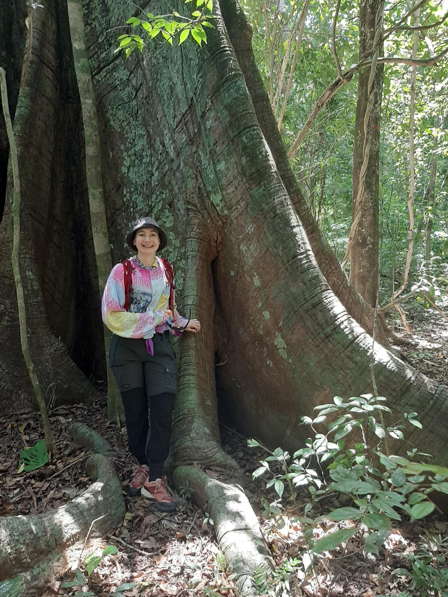

:::::: columns
::: {.column width="51%"}
{width="90%"}
:::

::: {.column width="49%"}

*Stuff I'm interested in:*\

Analysing ecology data.\
Bayesian (& frequentist) statistics. \
Ecotoxicology. \
Handling multiple data type. \
High performance computing. \
Model development & statistical inference. \
Movement ecology. \
(R) programming. \
Reproductibility. \
Spatial statistics.\
Teaching.\
(Tropical) forests. \
Upscaling biological levels from individual to landscape. \

:::
::::::

### Some info

* Research engineer at IRD [Institute of Research for Development](https://www.ird.fr/) since 2023, based in Montpellier, France.

* AMAP lab [botAny and Modeling of Plant Architecture and vegetation](https://amaplab.fr/en/index.php), POLIS [Computing for science](https://sites.amaplab.fr/polis/dev/)

* Member of ISI [IRD Network for informatics in research](https://www.ird.fr/isi), LiStat [International Research Network for Life Statistics](https://lamonica-d.github.io/site_web_listat/)

* [Github](https://github.com/lamonica-d), [Forge IRD](https://forge.ird.fr/dashboard/projects), email: dominique.lamonica[at]ird.fr

### Some of my current activities

* BIOMASS R package lead dev [CRAN](https://cran.r-project.org/web/packages/BIOMASS/index.html) & [Github](https://github.com/umr-amap/BIOMASS)

* gecevar R package development [Github](https://github.com/ghislainv/gecevar)

* R training ISI [more info](https://isi.pages.ird.fr/formations/welcome_isi_training/)

* Teaching 'Introduction to modelling' at Montpellier SupAgro

* ads R package maintainer [CRAN](https://cran.r-project.org/web/packages/ads/index.html)

### Publication list

J. Chave, S. L. Davis, ..., **D. Lamonica**, ..., et al. The GEO-TREES initiative: high-accuracy reference data for satellite-derived biomass mapping. In prep. \

N. Besson, P. Ploton, **D. Lamonica**, ..., P. Heuret. Beyond evergreen and deciduous: Contrasting canopy maintenance strategies in a Central African rainforest. In prep.\

S. Isnard, L. Cheng-Clavel, **D. Lamonica** and Y. Pillon. Does metal (Ni and Mn) hyperaccumulation shift plant position along the leaf economics spectrum? Submitted to *Environmental and Experimental Botany*, [preprint.](http://dx.doi.org/10.2139/ssrn.7360181) \

J. Engel, D. Sabatier, ..., **D. Lamonica**, ..., et al. Thirty-two years of inventory data (1986-2018) from the GUYADIV forest plot network in French Guiana, covering 100 ha and 90,000 trees. *Annals of Forest Science*, accepted.

V. Bazile, **D. Lamonica**, G. Le Moguédec, D. Marshall and L. Gaume. Variable contribution of inquilines to prey digestion in Nepenthes pitcher plants: the role of pitcher traits. *Phil. Trans. R. Soc. B*, [**2026**.](https://doi.org/10.1098/rstb.2025.0095) \

**D. Lamonica**, L. Charvy, D. Kuo, C. Fritsch, M. Coeurdassier, P. Berny and S. Charles. A brief review on models for birds exposed to chemicals. *Environmental Science and Pollution Research*, [**2025**.](https://doi.org/10.1007/s11356-024-34628-5) \

M. Riccardo Di Nicola, ..., **D. Lamonica**, ..., J. L. Dorne. The use of new approach methodologies for the environmental risk assessment of food and feed chemicals. *Current Opinion in Environmental Science & Health*, [**2023**.](https://doi.org/10.1016/j.coesh.2022.100416) \

**D. Lamonica**, S. Charles, B. Clément, and C. Lopes. Chemical effects on ecological interactions within a model-experiment loop. *PCI Ecotoxicology*, [**2022**.](https://peercommunityjournal.org/articles/10.24072/pcjournal.209/) \

S. Charles, ..., **D. Lamonica**, ..., C. Lopes. Generic solving of physiologically-based kinetic models in support of next generation risk assessment due to chemicals. *J Explor Res Pharmacol.*, [**2022**.](https://doi.org/10.14218/JERP.2022.00043) \

**D. Lamonica**, F. M. Schurr and J. Pagel. Predicting the dynamics of recently established tree populations: a framework for statistical inference and lessons for data collection. *Methods in Ecology in Evolution*, [**2021**.](https://doi.org/10.1111/2041-210X.13656) \

M. Nagler, N. Praeg, G. H. Niedrist, ..., **D. Lamonica**, ..., et al. Abundance and biogeography of methanogenic and methanotrophic microorganisms across European streams. *J Biogeogr.*, [**2021**.](https://doi.org/10.1111/jbi.14052) \

**D. Lamonica**, J. Pagel, E. Valdès-Correcher, D. Bert, A. Hampe and F. M. Schurr. Tree potential growth varies more than competition among spontaneously established forest stands of pedunculate oak (*Quercus robur* ). *Annals of Forest Science*, [**2020**.](https://doi.org/10.1007/s13595-020-00981-x) \

**D. Lamonica**, H. Drouineau, H. Capra, H. Pella and A. Maire. A framework for pre-processing individual location telemetry data for freshwater fish in a river section. *Ecological Modelling*, [**2020**.](https://doi.org/10.1016/j.ecolmodel.2020.109190) \

B. Clément and **D. Lamonica**. Fate, toxicity and bioconcentration of cadmium on *Pseudokirchneriella subcapitata* and *Lemna minor* in mid-term single tests. *Ecotoxicology*, [**2018**.](https://doi.org/10.1007/s10646-017-1879-z) \

**D. Lamonica**, *Capturer les interactions écologiques en microcosme sous pression chimique à travers le prisme de la modélisation*, PhD thesis, Ecologie, Environnement. Université de Lyon, [**2016**](https://doi.org/10.70675/df7b97ebz8707z47fezaf8az0788a9baeaca) \

**D. Lamonica**, B. Clément, S. Charles and C. Lopes. Modelling algae-duckweed interaction under chemical pressure within a laboratory microcosm. *Ecotoxicology and Environmental Safety*, [**2016**](https://doi.org/10.1016/j.ecoenv.2016.02.008) \

**D. Lamonica**, U. Herbach, F. Orias, B. Clément, S. Charles and C. Lopes. Mechanistic modelling of daphnid-algae dynamics within a laboratory microcosm. *Ecological Modelling*, [**2016**](https://doi.org/10.1016/j.ecolmodel.2015.09.020)

